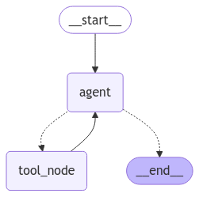
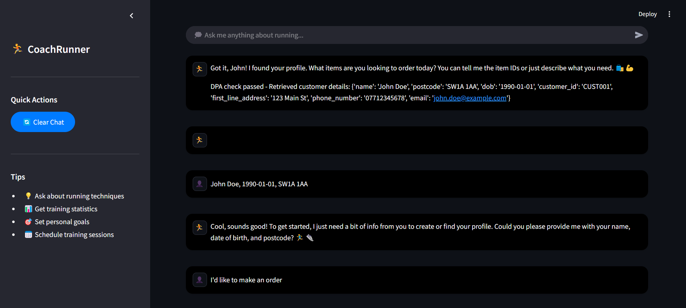
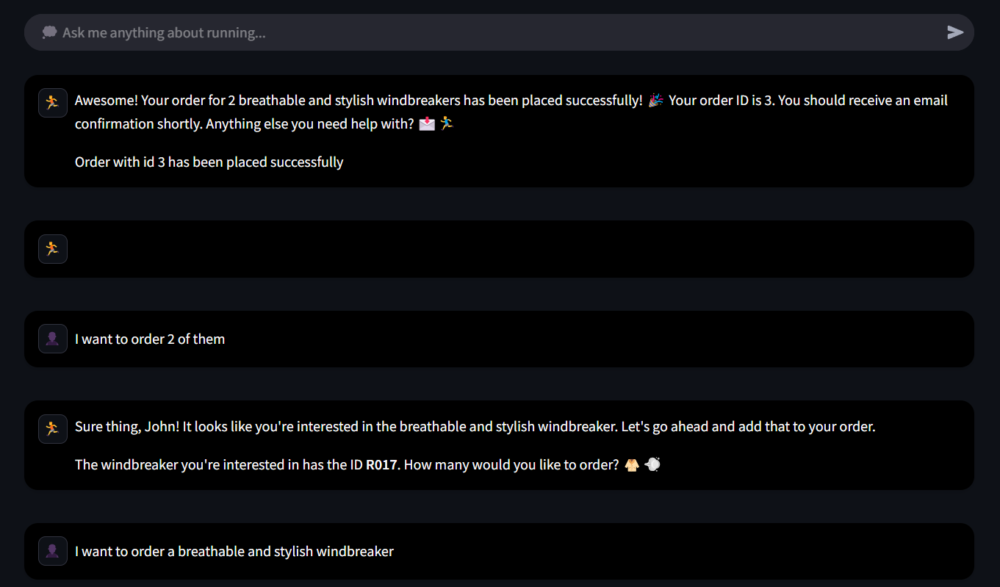
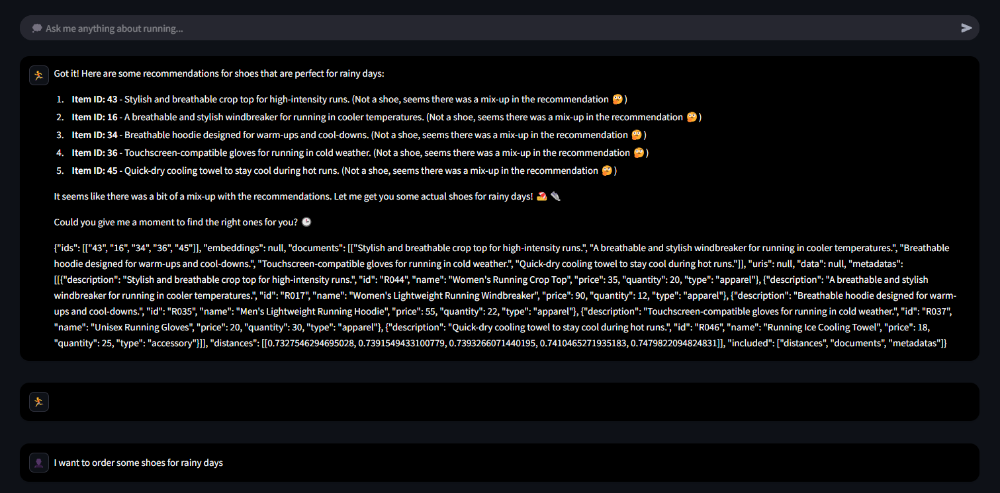

# 🏃 Coach Runner Agent

Coach Runner Agent is an intelligent customer support assistant designed for runner stores. It leverages a vector store to efficiently retrieve information, providing personalized product recommendations and assisting customers with inquiries and order management.  

<p align="center">
  
</p>

## 📖  Table of Contents
- [⚙️ Features](#-features)
- [🛠️ Tech Stack](#-tech-stack)
- [🚀 Installation](#-installation)
- [🤝 Contributing](#-contributing)
- [📃 License](#-license)

## ⚙️ Features

- 📘 Answer user inquiries about services and products.  
- 🎯 Recommend products based on user preferences.  
- 📦 Manage orders, including checking existing orders and placing new ones.  
- 👤 Create or retrieve customer profiles securely for order management. 

<p align="center">
  
</p>

---

<p align="center">
  
</p>

---

<p align="center">
  
</p>


## 🛠️ Tech Stack  
This project utilizes the following technologies:

- **Frontend:**  
  - **Streamlit**

- **Backend:**  
  - **Embedding models from Hugging Face** hosted on **Llama Index**  
  - **LLM model from [Groq](https://console.groq.com/docs/quickstart)**  
  - **ChromaDB** 
  - **LangChain** 
  - **LangGraph** 
  - **Docker** 


## 🚀 Installation

Follow the steps below to run the project locally:

### 1. Clone the Repository  
Start by cloning the repository to your local machine:

```bash
git clone https://github.com/PhamAnhTienn/Coach-Runner-Agent.git
cd Coach-Runner-Agent
```

### 2. Build and Start the Docker Containers
Use Docker Compose to build and run the project:

```bash
docker-compose up --build
```

### 3. Access the Application
Once the containers are up and running, you can access the application in your browser at:

```bash
http://localhost:8501
```

## 🤝 Contributing

This project is open to contributions. Please feel free to submit a PR.

## 📃 License

This project is provided under an MIT license. See the [LICENSE](LICENSE) file for details.

